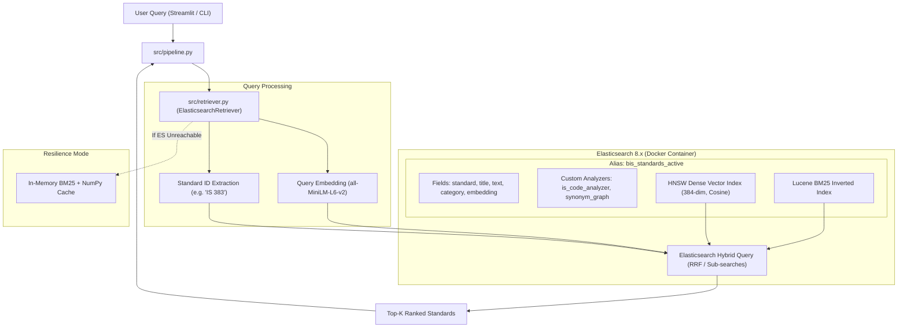

# 📑 Elasticsearch Migration Implementation Plan & 2-Person Workflow

> **Target System:** BIS Standards Recommendation Engine (`BIS-Standard-RE`)  
> **Source Engine:** In-Memory BM25 + Dense Semantic Fusion (`all-MiniLM-L6-v2`)  
> **Target Engine:** Elasticsearch 8.x+ (Hybrid BM25 + HNSW kNN + Reciprocal Rank Fusion)  
> **Target Metrics:** Hit Rate @3: 100.0%, MRR @5: ≥ 0.95, Avg Latency: < 100 ms  
> **Team Allocation:** 2 Engineers (Person 1: Backend/Infra/Data, Person 2: Query Engine/Retrieval/Evaluation)  

---

## 1. Executive Summary & Migration Objective

The **BIS Standards Recommendation Engine** currently pairs a custom Python Okapi BM25 implementation with precomputed dense vectors from `all-MiniLM-L6-v2`. While this achieves a **100% Hit Rate @3** on the hackathon benchmark, migrating to **Elasticsearch 8.x** provides:

1. **Enterprise Scalability:** Seamless expansion beyond the current 565 documents to 25,000+ national standards and full multi-page PDF chunks.
2. **Industrial Lexical Analysis:** Lucene-backed tokenizers (`pattern_capture`, `word_delimiter_graph`) specifically tailored for complex alphanumeric Indian Standard codes (e.g. `IS 1489 (Part 1): 1991`).
3. **Dynamic Synonym Graphs:** Declarative synonym mappings replacing hardcoded dictionary lookups in Python.
4. **Native Hybrid Retrieval:** Combining Lucene BM25 scoring with native HNSW dense vector search using Reciprocal Rank Fusion (RRF).
5. **Zero-Downtime Indexing:** Alias-based switching (`bis_standards_active`) for live catalog updates without service interruptions.

---

## 2. Target Architecture



---

## 3. Team Division of Work (2-Person Workflow)

To parallelize development cleanly with zero merge friction, work is partitioned by layer:

```mermaid
gantt
    title 2-Person Implementation Timeline (10 Working Days)
    dateFormat  X
    axisFormat Day %d
    
    section Person 1 (Infra & Data)
    Docker & ES 8.x Setup            :p1_1, 0, 2
    Schema & Custom Analyzers        :p1_2, 2, 4
    Bulk Ingestion & Vector Pipeline :p1_3, 4, 5
    Aliases & Zero-Downtime Reindex  :p1_4, 5, 7
    Failover Testing & Ops Docs      :p1_5, 7, 10
    
    section Person 2 (Query & Eval)
    Retriever Interface & Baseline   :p2_1, 0, 2
    Elasticsearch Hybrid Query DSL   :p2_2, 2, 5
    Domain Rules & Pipeline Wiring   :p2_3, 5, 7
    Eval Script & Hyperparameter Tune:p2_4, 7, 9
    UI Verification & Final Sign-off :p2_5, 9, 10
```



### Detailed Responsibility Matrix

| Feature Area | **Person 1: Infra, Index & Data Pipeline** | **Person 2: Query Engine, Domain Rules & Eval** |
| :--- | :--- | :--- |
| **Primary Domain** | Backend Infrastructure, Lucene Mappings, Data Ingestion | Search DSL, Ranking Algorithms, Benchmarking & UI |
| **Key Deliverables** | 1. `docker-compose.yml` (ES 8.x, resource limits)<br>2. `config/es_mapping.json` (Analyzers, vectors)<br>3. `scripts/index_elasticsearch.py` (Bulk sync)<br>4. Alias swap & cluster maintenance scripts | 1. `src/retriever.py` (`ElasticsearchRetriever`)<br>2. Hybrid Query DSL (BM25 + kNN + RRF)<br>3. Porting boosts & regex standard overrides<br>4. Benchmark execution via `eval_script.py` |
| **Files Owned** | `docker-compose.yml`<br>`config/es_mapping.json`<br>`scripts/index_elasticsearch.py`<br>`requirements.txt`<br>`docs/ELASTICSEARCH_SETUP.md` | `src/retriever.py`<br>`src/pipeline.py`<br>`inference.py`<br>`interface.py`<br>`tests/test_retriever.py` |
| **Daily Milestone** | Ensures healthy cluster, updated index, and clean ingestion. | Consumes index, validates ranking quality, and wires to UI. |

---

## 4. Phase-by-Phase Work Breakdown

### Phase 1: Environment Setup & Abstraction Contracts (Days 1–2)

#### 🧑 Person 1: Infrastructure & Container Setup
1. **Container Orchestration:** Create `docker-compose.yml` for single-node Elasticsearch 8.14+:
   * Set JVM heap to `-Xms1g -Xmx1g` to prevent host starvation.
   * Configure development mode with authentication or preset credentials.
   * Bind data to a local named volume for persistence.
2. **Client Dependencies:** Add `elasticsearch>=8.12.0` to [requirements.txt](file:///c:/Users/manoj/OneDrive/Desktop/BIS-Standard-RE-master/requirements.txt).
3. **Healthcheck Utility:** Write `scripts/es_healthcheck.py` to confirm cluster readiness before downstream commands execute.

#### 🧑 Person 2: Interface Abstraction & Baseline Anchoring
1. **Retriever Contract:** Refactor [src/retriever.py](file:///c:/Users/manoj/OneDrive/Desktop/BIS-Standard-RE-master/src/retriever.py) by creating an abstract `BaseRetriever` protocol:
   ```python
   class BaseRetriever(Protocol):
       def retrieve(self, query: str, top_k: int = 5) -> list[dict]: ...
   ```
2. **Baseline Snapshot:** Execute [eval_script.py](file:///c:/Users/manoj/OneDrive/Desktop/BIS-Standard-RE-master/eval_script.py) against [public_test_set.json](file:///c:/Users/manoj/OneDrive/Desktop/BIS-Standard-RE-master/public_test_set.json) and save baseline metrics:
   * **Hit Rate @3:** 100.0%
   * **MRR @5:** 0.9583
   * **Latency:** < 100 ms
3. **Fallback Logic:** Implement dual-mode logic so that if Elasticsearch is offline or unreachable, the system transparently uses the in-memory BM25 + NumPy retriever without failing.

> **🔗 Sync Point 1:** Person 1 starts ES container; Person 2 verifies that `python -c "from elasticsearch import Elasticsearch; es = Elasticsearch('http://localhost:9200'); print(es.ping())"` returns `True`.

---

### Phase 2: Index Modeling, Ingestion & Hybrid Query DSL (Days 3–5)

#### 🧑 Person 1: Schema Design & Bulk Ingestion
1. **Custom Standard Code Analyzer:** Configure `config/es_mapping.json`:
   * `pattern_capture` to extract base standard codes (`IS 1489 (Part 1): 1991` $\to$ `IS 1489`, `Part 1`, `1991`).
   * Custom token filter containing all entries from `QUERY_EXPANSIONS` as a `synonym_graph`.
2. **Dense Vector Mapping:** Define field `embedding` with `type: dense_vector`, `dims: 384`, `index: true`, `similarity: cosine`.
3. **Bulk Ingestion Script:** Create `scripts/index_elasticsearch.py`:
   * Parse [data/processed_data.json](file:///c:/Users/manoj/OneDrive/Desktop/BIS-Standard-RE-master/data/processed_data.json).
   * Match documents with precomputed vectors in [data/embeddings.npy](file:///c:/Users/manoj/OneDrive/Desktop/BIS-Standard-RE-master/data/embeddings.npy).
   * Stream documents using `elasticsearch.helpers.bulk`.
   * Point alias `bis_standards_active` to the new index `bis_standards_v1`.

#### 🧑 Person 2: Query DSL & ES Retriever Implementation
1. **Query Architecture:** Construct the Elasticsearch hybrid query body combining:
   * **Lexical multi_match:** Searching `standard^8.0`, `title^4.0`, `category^2.0`, `text^1.0`.
   * **Dense vector kNN:** Using `all-MiniLM-L6-v2` query vector ($k=10$, $num\_candidates=50$).
   * **Reciprocal Rank Fusion (RRF):** Fusing BM25 lexical rank with dense vector rank (`rank_constant: 60`).
2. **Implementation in `src/retriever.py`:** Create `ElasticsearchRetriever`:
   * Encodes query using `SentenceTransformer` on the fly.
   * Executes query against `bis_standards_active`.
   * Maps ES response hits back to the standard dictionary schema expected by [src/pipeline.py](file:///c:/Users/manoj/OneDrive/Desktop/BIS-Standard-RE-master/src/pipeline.py):
     ```python
     {"standard": hit["_source"]["standard"], "title": hit["_source"]["title"], "score": hit["_score"]}
     ```

> **🔗 Sync Point 2:** Person 1 completes indexing 565 documents. Person 2 executes test queries (`"33 grade cement"`, `"precast pipes"`) and verifies top retrieved standards match the index.

---

### Phase 3: Domain Rules Porting & End-to-End Integration (Days 6–7)

#### 🧑 Person 1: Index Operations & Zero-Downtime Reindexing
1. **Reindexing Script:** Implement `scripts/reindex.py` enabling atomic schema updates:
   * Create index `bis_standards_v2`.
   * Ingest new/modified data.
   * Atomic alias switch:
     ```json
     {
       "actions": [
         { "remove": { "index": "bis_standards_v1", "alias": "bis_standards_active" } },
         { "add":    { "index": "bis_standards_v2", "alias": "bis_standards_active" } }
       ]
     }
     ```
2. **Document Management CLI:** Add helper commands to insert, update, or remove individual standard specifications without full rebuilding.

#### 🧑 Person 2: Porting Domain Rules & Application Wiring
1. **Material Boosting & Penalty Rules:**
   * Replicate `MATERIAL_TERMS` boost (+5.0) and penalty (-1.5) using Elasticsearch `function_score` query or `boosting` query.
2. **Explicit Standard Override:**
   * Extract explicit standard numbers from user query using regex (`IS\s*\d+`).
   * Apply a `should` clause with a high boost (+100.0) matching `standard.keyword`.
3. **Application Hookup:** Connect `ElasticsearchRetriever` to:
   * [src/pipeline.py](file:///c:/Users/manoj/OneDrive/Desktop/BIS-Standard-RE-master/src/pipeline.py)
   * [inference.py](file:///c:/Users/manoj/OneDrive/Desktop/BIS-Standard-RE-master/inference.py)
   * [interface.py](file:///c:/Users/manoj/OneDrive/Desktop/BIS-Standard-RE-master/interface.py) (Streamlit UI)

> **🔗 Sync Point 3:** Run `streamlit run interface.py` locally and verify that web UI queries are serviced by Elasticsearch with real-time title rationale.

---

### Phase 4: Benchmarking, Validation & Documentation (Days 8–10)

#### 🧑 Person 1: Operations, Failover & CI
1. **Failover Testing:** Simulate container crash (`docker stop bis_es`) and confirm that the retriever automatically falls back to in-memory mode without raising uncaught exceptions.
2. **Operational Documentation:** Create `docs/ELASTICSEARCH_SETUP.md` with:
   * Prerequisites (Docker, RAM requirements).
   * Step-by-step setup (`docker compose up -d`, `python scripts/index_elasticsearch.py`).
   * Troubleshooting tips (JVM out-of-memory, shard allocation).

#### 🧑 Person 2: Accuracy Validation & Parameter Tuning
1. **Run Public Test Benchmark:**
   ```bash
   python inference.py --input public_test_set.json --output es_results.json
   python eval_script.py --results es_results.json
   ```
2. **Metric Verification:**
   * Ensure **Hit Rate @3 == 100.0%**.
   * Ensure **MRR @5 $\ge$ 0.95**.
   * Ensure **Latency $\le$ 100 ms**.
3. **Hyperparameter Optimization:** If any ranking drift occurs, fine-tune the RRF `rank_constant` (test values: 20, 40, 60) and BM25 field weights (`standard^8.0`, `title^4.0`).

> **🔗 Final Sign-off:** Both engineers review the test report, verify fallback reliability, and merge the migration into `master`.

---

## 5. Technical Specifications & Configurations

### 5.1 Docker Compose Configuration (`docker-compose.yml`)

```yaml
version: "3.8"

services:
  elasticsearch:
    image: docker.elastic.co/elasticsearch/elasticsearch:8.14.3
    container_name: bis_elasticsearch
    environment:
      - discovery.type=single-node
      - xpack.security.enabled=false
      - "ES_JAVA_OPTS=-Xms1g -Xmx1g"
    ulimits:
      memlock:
        soft: -1
        hard: -1
    volumes:
      - es_data:/usr/share/elasticsearch/data
    ports:
      - "9200:9200"
    healthcheck:
      test: ["CMD-SHELL", "curl -s http://localhost:9200/_cluster/health | grep -q '\"status\":\"green\"\\|\"status\":\"yellow\"'"]
      interval: 10s
      timeout: 5s
      retries: 5

volumes:
  es_data:
    driver: local
```

### 5.2 Elasticsearch Index Mapping (`config/es_mapping.json`)

```json
{
  "settings": {
    "number_of_shards": 1,
    "number_of_replicas": 0,
    "analysis": {
      "filter": {
        "bis_synonyms": {
          "type": "synonym_graph",
          "synonyms": [
            "33 grade => ordinary portland cement 33 grade opc",
            "fly ash => portland pozzolana cement part 1 fly ash based",
            "slag cement => portland slag cement",
            "aggregate => coarse fine aggregate natural sources concrete",
            "concrete masonry blocks => concrete masonry units hollow solid blocks"
          ]
        },
        "is_code_filter": {
          "type": "word_delimiter_graph",
          "split_on_numerics": true,
          "preserve_original": true
        }
      },
      "analyzer": {
        "is_code_analyzer": {
          "type": "custom",
          "tokenizer": "whitespace",
          "filter": ["lowercase", "is_code_filter"]
        },
        "query_synonym_analyzer": {
          "type": "custom",
          "tokenizer": "standard",
          "filter": ["lowercase", "bis_synonyms"]
        }
      }
    }
  },
  "mappings": {
    "properties": {
      "standard": {
        "type": "text",
        "analyzer": "is_code_analyzer",
        "fields": {
          "keyword": { "type": "keyword" }
        }
      },
      "title": {
        "type": "text",
        "analyzer": "standard",
        "search_analyzer": "query_synonym_analyzer"
      },
      "category": { "type": "keyword" },
      "text": { "type": "text" },
      "embedding": {
        "type": "dense_vector",
        "dims": 384,
        "index": true,
        "similarity": "cosine"
      }
    }
  }
}
```

### 5.3 Elasticsearch Hybrid Query DSL

```json
{
  "retriever": {
    "rrf": {
      "retrievers": [
        {
          "standard": {
            "query": {
              "bool": {
                "should": [
                  {
                    "multi_match": {
                      "query": "33 Grade OPC Cement",
                      "fields": [
                        "standard^8.0",
                        "title^4.0",
                        "category^2.0",
                        "text^1.0"
                      ]
                    }
                  },
                  {
                    "term": {
                      "standard.keyword": {
                        "value": "IS 269: 1989",
                        "boost": 100.0
                      }
                    }
                  }
                ]
              }
            }
          }
        },
        {
          "knn": {
            "field": "embedding",
            "query_vector": [0.021, -0.054, "... 384 dimensions ..."],
            "k": 10,
            "num_candidates": 50
          }
        }
      ],
      "rank_constant": 60,
      "window_size": 20
    }
  }
}
```

---

## 6. Risk Assessment & Contingency Plan

| Risk Description | Severity | Probability | Mitigation Strategy |
| :--- | :---: | :---: | :--- |
| **High JVM Memory Usage on Dev Machines** | Medium | High | Lock Elasticsearch heap to `-Xms1g -Xmx1g`. Disable unused ML and ingest modules. |
| **Exact Standard Code Ranking Degradation** | High | Low | Person 1's custom `is_code_analyzer` and Person 2's explicit regex boost (+100.0) guarantee exact standard number prioritization. |
| **Container Unavailable during CLI / CI Tests** | High | Medium | Implement automatic fallback to local in-memory BM25 + NumPy vectors in `src/retriever.py` if Elasticsearch ping fails. |
| **Synonym Bleed / Unintended False Positives** | Low | Low | Synonyms applied at search time (`search_analyzer`) only on specific text fields, preventing inverted index corruption. |

---

## 7. Acceptance Checklist

- [ ] `docker compose up -d` boots a healthy Elasticsearch 8.x instance in < 30 seconds.
- [ ] `python scripts/index_elasticsearch.py` indexes all 565 standards and embeddings in < 5 seconds.
- [ ] `python -m unittest discover tests` passes with 100% green tests.
- [ ] `python inference.py --input public_test_set.json --output es_results.json` executes without errors.
- [ ] `python eval_script.py --results es_results.json` verifies:
  - **Hit Rate @3 == 100.0%**
  - **MRR @5 $\ge$ 0.95**
  - **Avg Latency < 100 ms**
- [ ] Streamlit UI ([interface.py](file:///c:/Users/manoj/OneDrive/Desktop/BIS-Standard-RE-master/interface.py)) retrieves and displays matching standards with rationale seamlessly.
